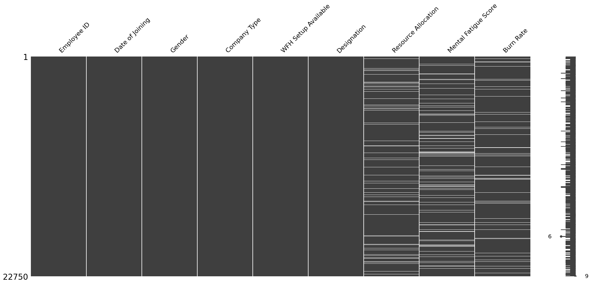
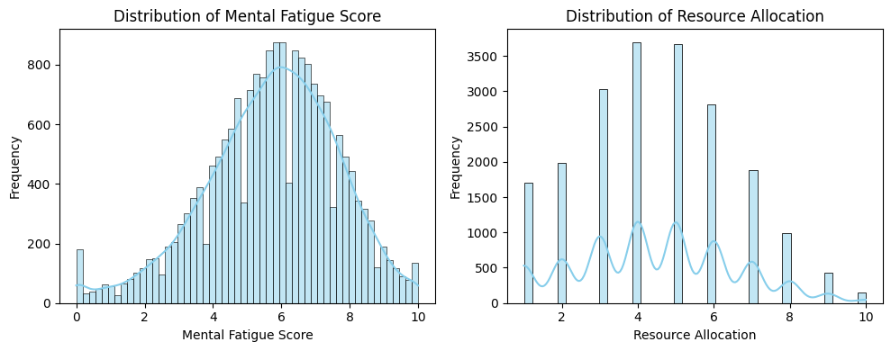
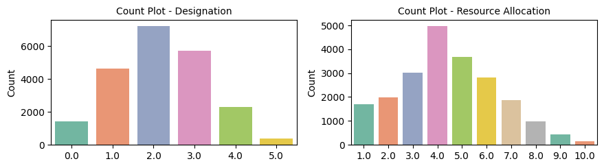
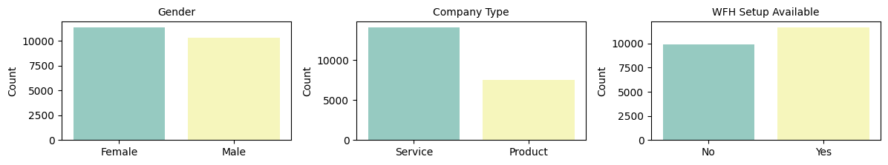
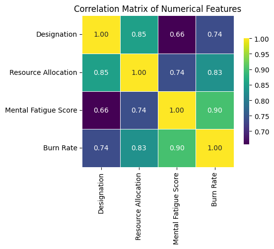

# Employee Burnout Rate Prediction

This repository advances the original project by implementing modern machine learning workflows and enhancing reproducibility, scalability, and code clarity. The goal remains: predict employee burnout rates using a robust, data-driven modeling pipeline that supports HR decision-making with precision.

---

## 📙 Table of Contents

1. [Problem Statement](#1-problem-statement)
2. [Data](#2-data)
3. [Exploratory Data Analysis](#3-exploratory-data-analysis)
4. [Model Performance & Evaluation](#4-model-performance--evaluation)
5. [Improvements Made](#5-improvements-made)
6. [Contributing](#6-contributing)

---

## 1. Problem Statement

According to Mercer (2024), 80% of employees are at risk of burnout. Undetected burnout leads to elevated turnover, absenteeism, and HR costs. Early detection using machine learning enables targeted intervention and promotes sustainable performance across organizations.

---

## 2. Data

The dataset contains the following features:

* Join date
* Company type
* Designation
* Hours worked per day
* Mental fatigue score
* Availability of remote work
* Target variable: burnout rate

---

## 3. Exploratory Data Analysis

### 3.1 Missing Data Handling

* Target-null rows were removed.
* Resource Allocation: median imputation
* Mental Fatigue Score: mean imputation

|               Missingness Overview              |              Distribution Overview             |
| :---------------------------------------------: | :--------------------------------------------: |
|  |  |

### 3.2 Univariate & Categorical Insights

* Most employees are mid-level professionals.
* Daily hours cluster around 4–5, indicating output-focused workflows.
* Majority work remotely.
* Balanced gender distribution.
* Service department dominates.

### 3.3 Bivariate Insights

* Burnout increases with designation and daily working hours.
* Mental fatigue is strongly correlated with burnout.

---

## 4. Model Performance & Evaluation

Four regressors were trained using 5-fold cross-validation. Mean Squared Error (MSE) served as the evaluation metric. GridSearchCV was used to fine-tune the top models.

| Model                    | MSE (CV) | MSE (Tuned) |
| ------------------------ | -------- | ----------- |
| Linear Regression        | 0.0050   | -           |
| Lasso Regression         | 0.0393   | -           |
| Support Vector Regressor | 0.0044   | 0.0044      |
| Random Forest Regressor  | 0.0043   | **0.0036**  |

  

---

## 5. Improvements Made

* Introduced consistent cross-validation for fair model comparison
* Cleaned up code and added comments/emojis for readability and structure.
* Used `make_scorer` with MSE to unify evaluation across models
* Final predictions evaluated on holdout test set
* Adopted structured code sections with semantic headings and emojis for better UX
* Added logic to make sample predictions using the trained model and compare them against ground truth.
* Serialized the best-performing model (Random Forest) using joblib for future inference.

---

## 6. Contributing

Contributions are welcome!

1. Fork this repo
2. Create your feature branch (`git checkout -b feature/AmazingFeature`)
3. Commit your changes (`git commit -m 'Add some AmazingFeature'`)
4. Push to the branch (`git push origin feature/AmazingFeature`)
5. Open a pull request

Please follow PEP8 and include docstrings/comments where relevant.

---

## 7. License

This project is licensed under the [MIT License](LICENSE).

---
